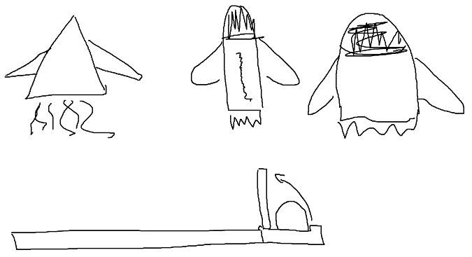
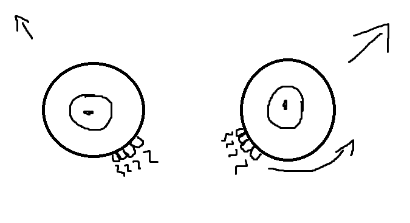

## TODO:
1. ~~Block all inputs, movement, etc. while map rotating.~~
2. Add accelerate button for joypad.
3. Choose direction in the moment of collision like arrove and few sec to choose
4. Objects with events
   - add points for bounsing, destroy blocks etc.
   - extra balls
   - rocket (controlled by right joyAxis), need some static palyer time to launch
   - portals witch 
   - blocks (destroyable, drop modifiers, witch rotates by time, etc)
   - not only rectangle - 6-anglers, triangles
5. Revers controls for player tempoarly
6. Map rotation:
   - rotate clock\clockwise directions
   - use referenced controls for player up/down for vertical, left\right for horizontal
   - 
7. Map timer - for ending
8. Count down timer
9. Jump a little
10. Point based pay system for events\objects
11. Ball ```types```:
    - fire
    - ice
    - invisible
    - transparent
    - 
12. Ball ```modifications```:
    - size
    - speed
    - bounce behavior
    - **EXTENDED - angular speed, rotation, not linear directino**
13. Use events/object only while ball in your triangle
14. Player panel:
    - increase/decrease size
    - sticky + choose direction(3 point)
    - shooting?
    - magnetism
15. Add some perk mechanic, like in crimsonland

## Levels:

1. Destroy all blocks
2. Hit all corners in right order
3. Get special amount of points
4. Survive some time
5. Boses

## Sketches


* ball can fly to the open panel when rocket launched, then ball can be burped(відрижка) out with some sound




